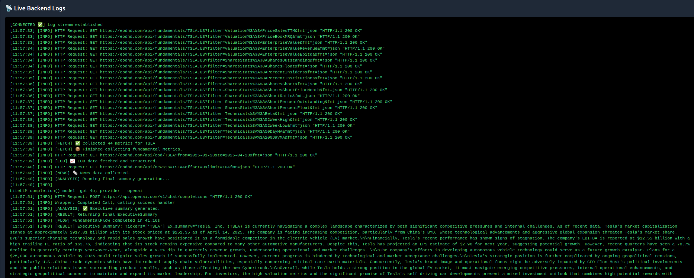
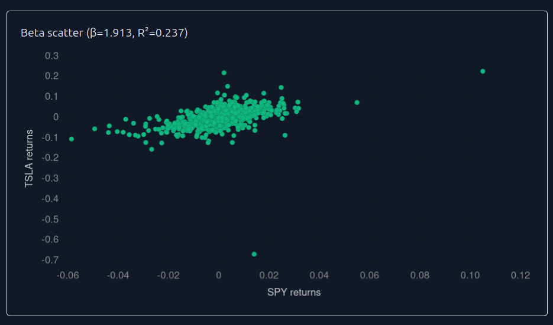

[](https://opensource.org/licenses/Apache-2.0)


# Chat with Fundamentals — AI-powered Fundamental Analysis and Stock Research

**Chat with Fundamentals** is an application that generates executive summaries about stocks from fundamental data fetched via EODHD APIs. It integrates financial metrics, historical stock prices, recent company news, and AI-written executive summaries into a single orchestrated workflow. It is designed to streamline the fundamental analysis of securities.

Built with **CrewAI**, **LangChain**, **FastAPI**, and **EODHD APIs** market data.


---

## Project Philosophy

Chat with Fundamentals is not intended to be a SaaS platform. It is a **research engine** designed to explore how autonomous agents and AI can automate and enhance financial analysis. It is designed to be deployed **local-first** and tailored to user needs through refinement and upgrade of AI and quantitative workflows.  
All LLM interactions are logged and saved into a file.




Key principles include:

- **Modularity**: Workflows and agents are designed independently.
- **Reproducibility**: All steps (query, fetch, summarize) are transparent and testable.
- **Minimal Overhead**: Lightweight backend with no complex infrastructure.
- **User Ownership**: Users bring their own API keys (OpenAI, EODHD).

---

## Project Structure

```
backend/
├── agents/           # CrewAI agents (e.g., fundamental interpreter)
├── core/             # Configuration, logging, LLM settings
├── models/           # Pydantic models for finance data
├── routers/          # API routes (analyzer, simulater, quantanalyzer)
├── tools/            # EODHD API tools (data, news fetching)
├── utils/            # Helper functions (e.g., schema generation)
├── workflows/        # CrewAI-based orchestration (e.g., analyze.py)
├── venv/             # Virtual environment (optional)
├── .env              # Environment variables (API keys, model names)
├── .gitignore
└── chatwithfundamentals.log
```

---

## Core Workflows

### 🔹 Analyze Fundamentals (CrewAI Workflow)

- Parses user query (e.g., "Analyze Apple and Tesla fundamentals").
- Builds a structured **DataFetchPlan**.
- Fetches:
  - Fundamental metrics (e.g., P/E ratio, revenue)
  - EOD historical prices
  - Recent news
- Generates an **Executive Summary** written by an LLM.


### 🔹 Quantitative API Endpoints (FastAPI)

- **Monte Carlo Simulation** of future stock prices (`/simulate`)
- **Daily Return Distribution** and **Beta Estimation** (`/returns`)
- **Cumulative Return Comparison** vs benchmark (`/cumret`)



---

## Getting Started

### 1. Install requirements

```bash
pip install -r requirements.txt
```

### 2. Set up environment variables

```env
OPENAI_API_KEY=your-openai-key
EODHD_API_KEY=your-eodhd-key
MODEL_NAME=gpt-4o
```

### 3. Run FastAPI server

```bash
uvicorn backend.routers.simulater:router --reload
```

(or integrate all routers into a main FastAPI app)

### 4. Run the analysis programmatically

```python
from backend.workflows.analyze import FundamentalFlow

flow = FundamentalFlow()
result = flow.invoke(inputs={"user_query": "Analyze AAPL and TSLA fundamentals and forecast returns"})
print(result.model_dump_json(indent=2))
```

---

## Example API Usage

- `GET /equity/simulate?ticker=TSLA&horizon=20` — Simulate future price paths.
- `GET /equity/returns?ticker=AAPL&years=3&benchmark=SPY` — Daily returns & beta.
- `GET /equity/cumret?ticker=GOOG&years=5&benchmark=SPY` — Cumulative return vs benchmark.

---

## Future Enhancements

- Alpha extraction with Alphalens.
- Sentiment analysis integration from news.
- Expanded technical indicator analytics (MACD, RSI, etc.).

---

## License

This project is intended for research and personal development use.  
Commercial deployments must comply with **OpenAI** and **EODHD** licensing.

---

## Author

- **S.M. Laignel, running consultancy SL MAR, developing QuantCoder FS — an automation platform for research workflows in Finance.**
  - [Substack](https://quantcoderfs.substack.com)
  - [GitHub](https://github.com/sl-mar/chat-with-fundamentals)

---
