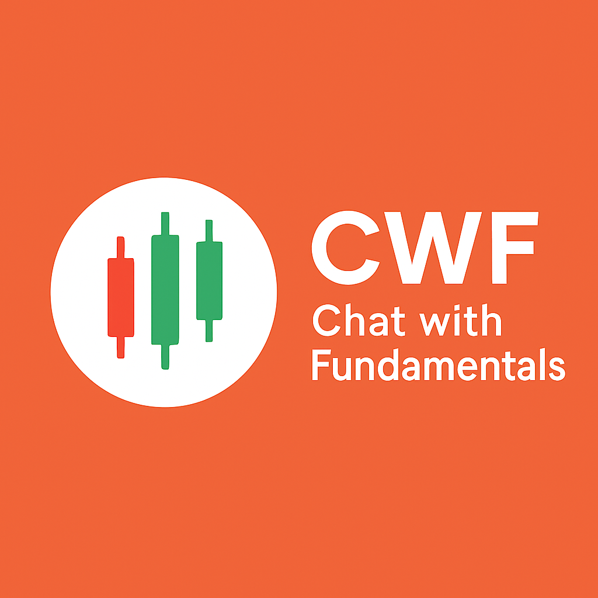
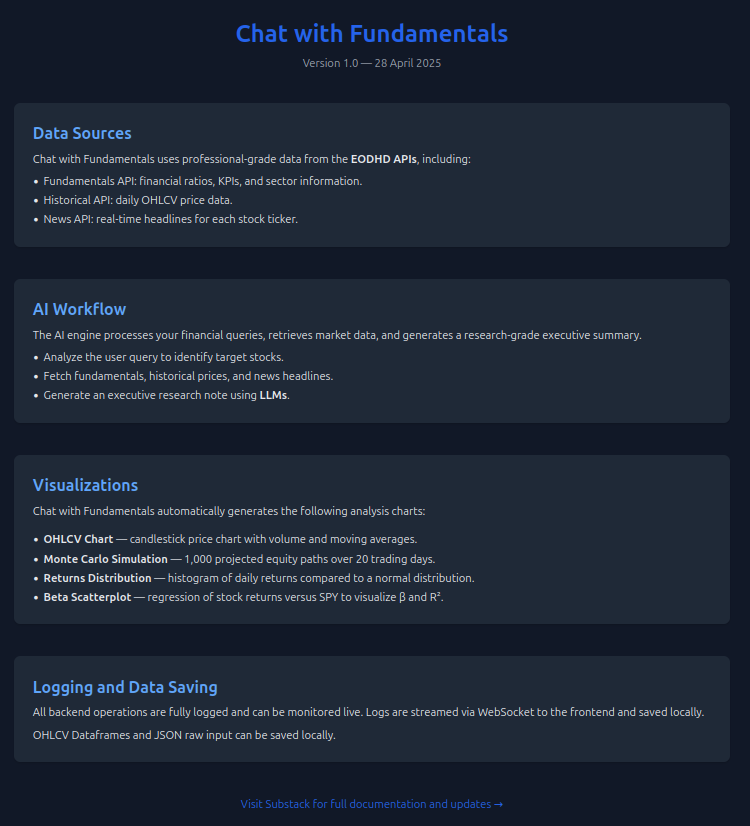
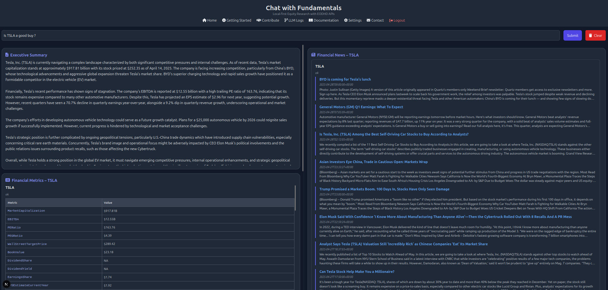
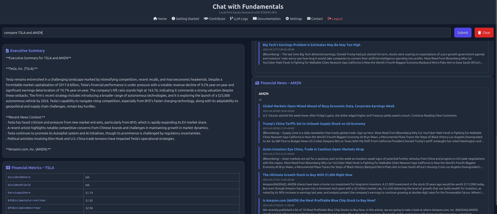
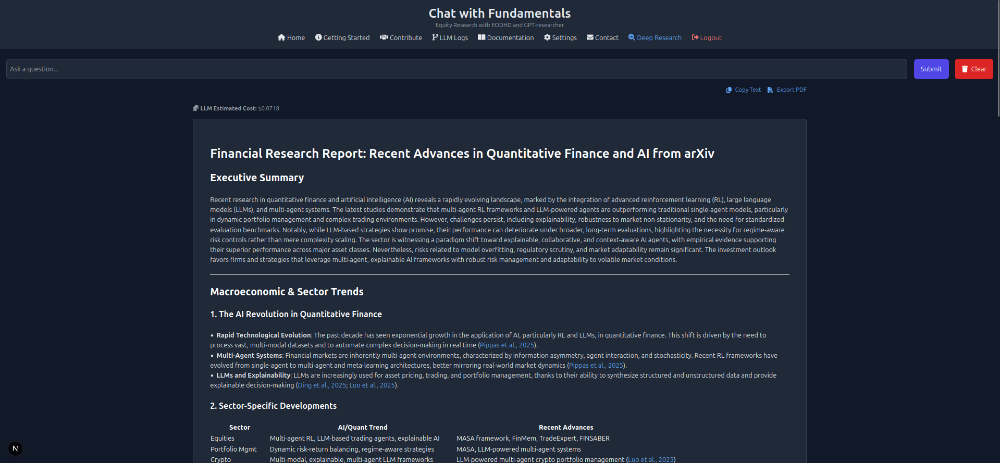
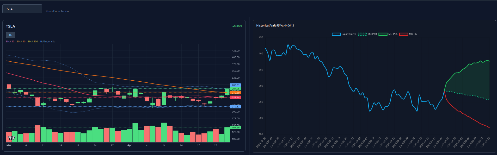

[](https://opensource.org/licenses/Apache-2.0)

<p align="center">
  
</p>

# Chat with Fundamentals — AI-powered Fundamental Analysis and Stock Research

**Chat with Fundamentals** is an application that generates executive summaries about stocks using fundamental data fetched via EODHD APIs.  
It integrates financial metrics, historical stock prices, recent company news, and AI-written executive summaries into a single orchestrated workflow — designed to streamline the fundamental analysis of securities.

Built with **CrewAI**, **LangChain**, **FastAPI**, and **EODHD APIs** market data.

<p align="center">
  
</p>

---

## Project Philosophy

Chat with Fundamentals is not intended to be a SaaS platform.  
It is a **research engine** designed to explore how autonomous agents and AI can automate and enhance financial analysis.  
It is built to be **self-hosted** and **tailored to user needs** through the refinement and upgrade of AI and quantitative workflows.  
All LLM interactions are logged and saved for reproducibility.

<p align="center">
  
</p>

**Key principles:**

- **Modularity**: Workflows and agents are designed independently.
- **Reproducibility**: All steps (query, fetch, summarize) are transparent and testable.
- **Minimal Overhead**: Lightweight backend with no complex infrastructure.
- **User Ownership**: Users bring their own API keys (OpenAI, EODHD, Tavily).

---

## Project Structure

Backend is built on Python and FastAPI.


```
backend/
├── agents/           # CrewAI agents (e.g., fundamental interpreter)
├── core/             # Configuration, logging, LLM settings
├── models/           # Pydantic models for finance data
├── routers/          # API routes (analyzer, simulater, quantanalyzer)
├── tools/            # EODHD API tools (data, news fetching)
├── utils/            # Helper functions (e.g., schema generation)
├── workflows/        # CrewAI-based orchestration (e.g., analyze.py)
├── venv/             # Virtual environment (optional)
├── .env              # Environment variables (API keys, model names)
├── .gitignore
└── chatwithfundamentals.log
```

Frontend is built on Next.js

```
frontend/
├── components/         # Reusable React components (UI, layout, forms)
├── Icons/              # Custom icon components
├── lib/                # Client-side utilities and API routes
├── pages/              # Next.js pages 
├── public/             # Static assets (images, fonts)
├── styles/             # Global and modular CSS/Tailwind styles
├── types/              # TypeScript type declarations
├── LICENSE.md          # Project license information
├── NOTICE.txt          # Legal and attribution notices
├── next.config.js      # Next.js configuration
├── next-env.d.ts       # Next.js environment type definitions
├── package.json        # Project metadata and dependencies
├── package-lock.json   # Exact dependency tree
├── postcss.config.js   # PostCSS configuration (used with Tailwind)
├── tailwind.config.js  # Tailwind CSS configuration
└── tsconfig.json       # TypeScript compiler configuration
```


---
## Deployment

You can run **Chat with Fundamentals** locally on **Linux/macOS** or **Windows**. Setup scripts are included for convenience.

### 🔹 Linux/macOS

```bash
bash deploy.sh
```

### 🔹 Windows

```bat
deploy.bat
```

These scripts will:

- Create a Python virtual environment  
- Install Python and frontend (Node.js) dependencies  
- Copy `.env.model` to `.env` if it doesn’t exist  

✅ After setup, refer to 'Getting Started' below.

---

## Launch

Once installed, you can launch the full application stack with a single command.

### 🔹 Linux/macOS

```bash
bash launch.sh
```

### 🔹 Windows

```bat
launch.bat
```

These launch scripts will:

- Open the project in VS Code  
- Start the frontend (Next.js) at http://localhost:3000  
- Start the backend (FastAPI) at http://localhost:8000  
- Open both interfaces in your default web browser  

📌 **Required File: `AAPL.US.json`**

⚠️ Do not delete or rename `AAPL.US.json` in the project root.  
This file is used as a reference knowledge base for internal agents during summary generation and analysis.  
It must remain present for the system to function correctly, even if you're analyzing other tickers.  
To test with other stocks, you may duplicate this file and modify the contents — but keep the original intact.

---
## Typical Use Cases

Chat with Fundamentals enables multiple forms of AI-supported equity research workflows, built around real market data and fundamental analysis.

### 🔹 Single-Ticker Research

- **Example Query**: `"Is TSLA a good buy?"`
- **Workflow**:
  - Parses the query and identifies TSLA as the target ticker.
  - Fetches the latest OHLCV data, fundamental metrics, and recent news via EODHD APIs.
  - Generates a concise, LLM-written executive summary.
  - Saves the raw data (quotes, metrics, news) in structured JSON format for further use.
  - Provides access to extended analytics:
    - TradingView-style financial chart.
    - Monte Carlo simulation of future stock paths.
    - Value at Risk (VaR) estimation.
    - Daily returns distribution analysis.
    - Correlation and beta scatter plot versus a benchmark.
    - 3-year cumulative returns comparison with the benchmark.

<p align="center">
  
</p>

---

### 🔹 Comparative Research

- **Example Query**: `"Compare TSLA and AMZN"`
- **Workflow**:
  - Parses and recognizes multiple tickers (TSLA, AMZN).
  - Fetches individual fundamentals, OHLCV data, and news for both.
  - Constructs a comparative executive summary focusing on:
    - Relative financial performance.
    - Recent price action comparison.
    - News sentiment comparison.
  - Provides side-by-side analytics for both tickers.

<p align="center">
  
</p>

---
### 🔹 Deep Research with GPT-researcher

- **Example Query**: `"What are the last articles about AI and Quant Finance from ArXiv"`
- **Workflow**:
  - Performs a deep research using Tavily/GPT-researcher.
  - Constructs a comprehensive financial research report addressing the user query.
  - Provides clickable links to the source used.

<p align="center">
  
</p>

---

## Built-in Quantitative Analytics

Chat with Fundamentals includes a fully local-first analytics suite, extending beyond LLM summaries:

- **Monte Carlo Simulation**: Future stock path modeling over user-defined horizons.
- **Value at Risk (VaR) and Expected Shortfall (ES)**: Quantitative risk estimates.
- **Return Distribution Histograms**: Visualizing daily return variability.
- **Beta and R² Scatter Plots**: Correlation analysis against benchmarks.
- **3-Year Cumulative Return Comparison**: Ticker vs benchmark over multiple years.

<p align="center">
  
</p>


Planned future enhancements include:

- Rolling Sharpe ratios and volatility bands.
- Calendar heatmaps of returns.
- Autocorrelation (ACF/PACF) plots.
- Volatility cones and regime-change indicators.
- Drawdown and underwater curve visualizations.

---

## Getting Started

### 1. Install requirements

```bash
pip install -r requirements.txt
```

### 2. Set up environment variables

```env
OPENAI_API_KEY='your_openai_key_here' (Required)
EODHD_API_KEY='your_eodhd_key_here'   (Required for the automated fundamental analysis) 
TAVILY_API_KEY='your_tavily_key_here' (Optional)
```

### 3. Run FastAPI server

```bash
uvicorn main:app --reload
```

### 4. Run the analysis programmatically

```python
from backend.workflows.analyze import FundamentalFlow

flow = FundamentalFlow()
result = flow.invoke(inputs={"user_query": "Analyze AAPL and TSLA fundamentals and forecast returns"})
print(result.model_dump_json(indent=2))
```

---

## Future Enhancements

- Intraday and real-time data integration
- Quantitative analytics and visualizations
- Alpha extraction with Alphalens.
- Sentiment analysis integration from news.

---

## License

This project is intended for research and personal development use. Commercial deployments must comply with **OpenAI**,**EODHD** and **GPT-Researcher** licensing.

---

## Changelog

**Current Version:** v1.0.1
- Added Deep Research function with GPT-researcher
- Added volatility and performance ratios.
- Still in **dev** branch.

**Baseline Version:** v1.0 (AI Workflow)

This release establishes the software baseline, aligned with version 1.0 of the agentic workflow. It includes 4 of the 10 identified quantitative analysis modules and supports multi-ticker comparisons. A stock scanner is not yet included but is planned as part of the upcoming QuantAgents project. Future versions will reflect significant updates to agent logic or orchestration.

---

## Disclaimer

This application and its associated research outputs are provided solely for informational and educational purposes. Nothing contained within this repository, its documentation, or its outputs should be construed as financial advice, or as an offer, recommendation, or solicitation to buy or sell any security, product, or service.

Users are solely responsible for their own investment and trading decisions.  
The author(s) make no representations or warranties as to the accuracy, completeness, or suitability of the content for any purpose.  
By using this application, you acknowledge that you must exercise independent judgment, conduct your own due diligence, and refer to the Terms of Use and Disclaimer pages provided within the application.

---
## Author

<p align="center">
  <b>S.M. Laignel</b><br>
  Founder of <b>SL MAR</b> consultancy<br>
  AI and Quant Finance<br><br>
  💻 <a href="https://github.com/sl-mar/chat-with-fundamentals">GitHub Repository</a>
</p>

---
